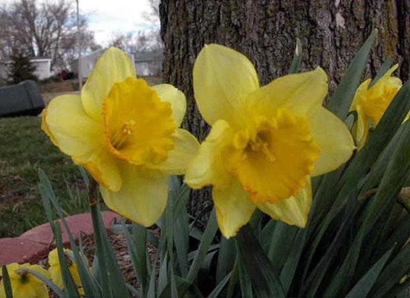

# Assignment 1:
### Short description:
This assignment shows how you can make two different image search algorithms, one using colour histograms and one using a convlutional neural network. By generating colour histograms for each image in a database of different images of flowers, normalizing the histograms to a value between 0 and 1, and then calculating the average distance between colour channels, it finds the 5 images with lowest distance to a reference image. The other algorithm find the 5 most similar images by using a VG166 pretrained convolutional neural network and using K-Nearest Neighbours.

### Data source:
The dataset consists of 17 categories of flowers each with 80 images and a total of 1360. The data can be found [here](https://www.robots.ox.ac.uk/~vgg/data/flowers/17/).

### Repository structure:
The repository contains:

- `in` folder in which to manually put downloaded data.
- `out` folder containing .csv files for each search algorithms 5 most similar images.
- `refs` folder containg the reference image and the two images with most similar colour histograms.
- `src` folder containg the `script.py` file
- `README.md` file
- `requirements.txt` file containing all required packages 
- `run.sh` file to run the script
- `setup.sh` file to create virtual environment and install required packeges prior to running the script

### Reproducing the analysis:

1. Download the date from [here](https://www.robots.ox.ac.uk/~vgg/data/flowers/17/), open the zipfile and place the `jpg` folder in the `in` folder.

2. In order to do the setup before running the script, create a virtual environment, install the required packages and deactivate the virtual environment again by running `bash setup.sh` in the terminal.

3. In order to run the script, activate the virtual environment, run the script and deactivate the virtual environment by running `bash run.sh` in the terminal.

4. In order to see the results of the script, showing the 5 most similar images to the reference image, open the `distance.csv` file in the `out` folder.

### Discussion/summary:
The reference image is shown below, and the most and second most similar image are displayed below that, showing how the colour histogram image search algorithm in the first case finds a different flower, but with the same colour, and in the second case finds a flower only partially similarly coloured. It is therefore safe to say, that the efficiency of a colour histogram search algorithm is very limited. 

The CNN search algorithm however is much more precise. The first 80 images contain the first of 17 categories of flowers, and the CNN has placed all of the 5 most similar images within the first 80 images, meaning that they are all correctly identified.

### Limitations and improvement
- The histogram approach is innacurate, because it only catches the colour distribution and does not catch the spatial distribution of the colours. 
- An improvement would be a histogram based image search algorithm, that includes ways of analysing the spatial distribution of the colours. 
- The CNN approach is accurate, but computationally intensive.