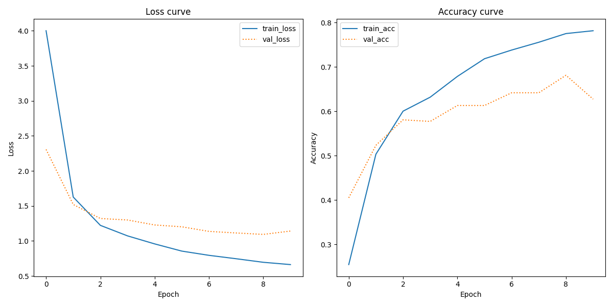

# Assignment 3:
### Short description:
This assignment shows how you can train a VGG16 convolutional neural network to do document classification, through visual characteristics rather than textual, determining the type of the document. The script trains the VGG16 model on the `Tobacco3482` dataset and ouputs the learning curves and the classification report for the model.

### Data source:
The `Tobacco3482` dataset contains 3482 files of 10 different document types. The data can be found [here](https://www.kaggle.com/datasets/patrickaudriaz/tobacco3482jpg/data).

### Repository structure:

- `in` folder in which to manually put downloaded data.
- `out` folder containing a classification report and learnings curves
- `src` folder containg the `main.py` file
- `README.md` file
- `requirements.txt` file containing all required packages 
- `run.sh` file to run the script
- `setup.sh` file to create virtual environment and install required packeges prior to running the script

### Reproducing the analysis:
1. Download the date from [here](https://www.kaggle.com/datasets/patrickaudriaz/tobacco3482jpg/data), open the zipfile and place the `Tobacco3482-jpg` folder in the `in` folder.

2. In order to do the setup before running the script, create a virtual environment, install the required packages and deactivate the virtual environment again by running `bash setup.sh` in the terminal.

3. In order to run the script, activate the virtual environment, run the script and deactivate the virtual environment by running `bash run.sh` in the terminal.

4. In order to see the results of the script, open the `classification_report.txt` and the `learning_curves.png` files in the `out` folder.

### Discussion/summary:
The classification report shows a generally high precision with a weighted average f1-score of 0.71, but the variance of precision between classes is quite high, the highest being 0.93 and the lowest being 0.45.
The learning curves shows the loss curve decreases over epochs while the accuracy curve increases, indicating that the model is effectively improving. However, the validation loss and accuracy does not perform as well, indicating that the model is overfitting, since it perfoms well on the training data, but not on the unseen validation data.

### Limitations and improvement
- The classification report shows a high performance on the classes with larger support, such as `Email` and `Letter`, and a lower performance on classes with less support, such as `Report` and `Note`, indicating that the model needs more data for these classes in order to perform better.
- The model seems to be overfitting, and could be improved by adjusting the model, for example by addig dropout regularization. 